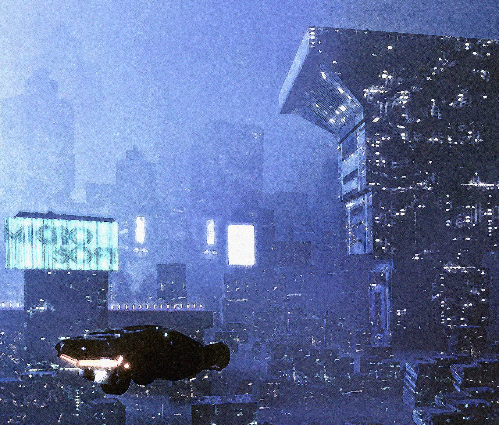
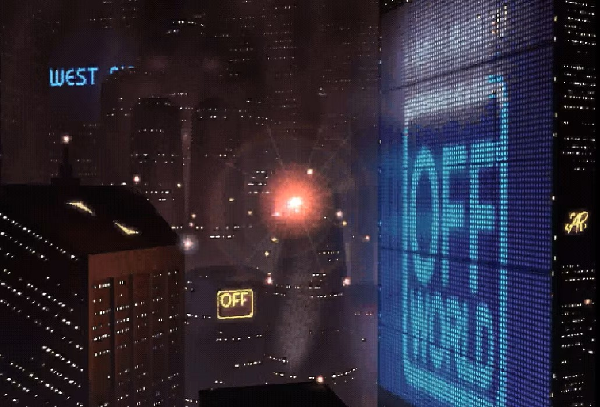
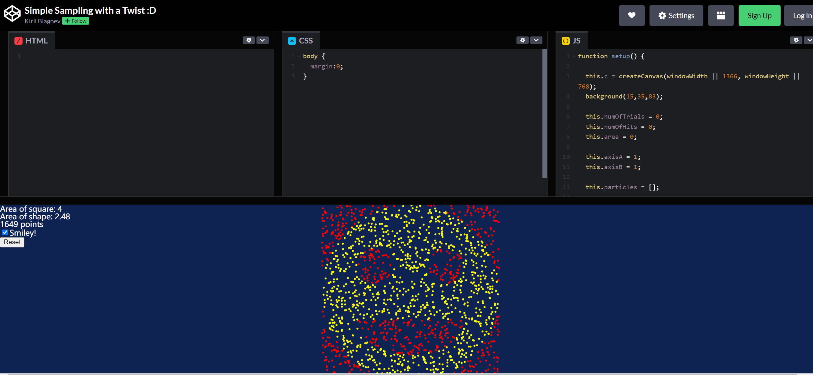

# jxue0800_9103_quiz8

## Part 1
The image technique that inspired me came from the urban landscape design in the movie "Blade Runner". From a distance, the lights in the buildings look like countless round or square glowing points gathered together, while the image of the pixel-style billboard is composed of different glowing rectangles. All this reminds me of the topic of the final assignment, which requires us to select abstract works. Most of the works are composed of many simple geometric elements (rectangles, circles). Although the style is different, the principle is the same, just like pixels make up an image.

## Part 2
I found a piece of code that uses p5.js, which first gives the smiley face status, then uses draw () to generate the dot, then uses checkHit () to check if the dot is inside the smiley face shape, and show () determines what color the dot should be in which position. 

But the positions of the dots are random, not ordered. I thought it would be possible to write a piece of code that would arrange the dots in a certain way, make them parallel and vertical, and give a certain space between each dot, so that you could produce the kind of pixel-like billboards and lights that you see in the picture.

***Link to the example code: *** https://codepen.io/tihawk/pen/XGNyEL
